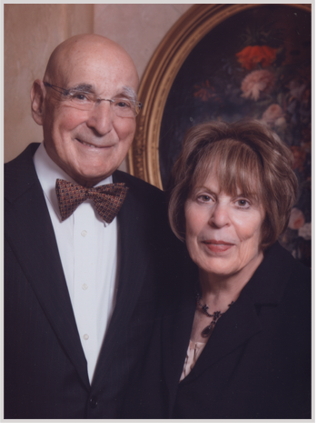

Arnold H. Kaplan is retired from
UnitedHealth Group, where he served as chief financial officer. Prior to joining UnitedHealth Group, Mr. Kaplan was
senior vice-president and chief financial officer for Air Products and Chemicals, Inc.. He is a native of Pittsburgh,
Pennsylvania. Kaplan and his wife Deanne, who have two children and six grandchildren, currently reside in the Sarasota
area of Florida. Deanne Kaplan, originally from Pittsburgh, has a degree in history from the University of Pittsburgh.
She taught history and was active in Jewish communal life, having served as the local chapter president of Hadassah (the
Women’s Zionist Organization) in Allentown and in West Chester.

Arnold Kaplan received his bachelor of science degree in commerce and engineering from Drexel University in 1962. He
received a master's of science degree in industrial administration from Carnegie-Mellon University in 1964. Kaplan
served on the board of the American Jewish Historical Society and is a trustee of the UnitedHealth Group Charitable
Remainder Trust. He has served on the boards of the Lehigh Valley Hospital & Health Network, the Allentown Art Museum,
the Jewish Federation of Sarasota-Manatee and in Allentown, and the Baum School of Art. Kaplan is past chairman of the
Alumni Board of Governors of Drexel University.

Dee and Arny’s shared passion for the past led them into collecting. The Kaplans began collecting in the early 1970s at
Renninger's Antique Market near Lancaster, Pennsylvania. They also traveled to paper and book shows in Pennsylvania, New
Jersey, and New England. Beginning in the early 1980s, they became active in auctions in New York. With the growth of
the World Wide Web in the 1990s, the Kaplans discovered yet another source for collectibles. In addition to the Arnold
and Deanne Kaplan Collection of Early American Judaica, the Kaplans also built a small collection of American non-Jewish
material in the course of their decades of collecting
together. <u> [The  Arnold and Deanne Kaplan collection of Americana](http://dla.library.upenn.edu/dla/ead/detail.html?id=EAD_upenn_rbml_MsColl1094)</u> (
not to be confused with the Kaplan Collection of Early American Judaica) consists of printed works, manuscripts, and
photographs, which they also have donated to the Penn Libraries.