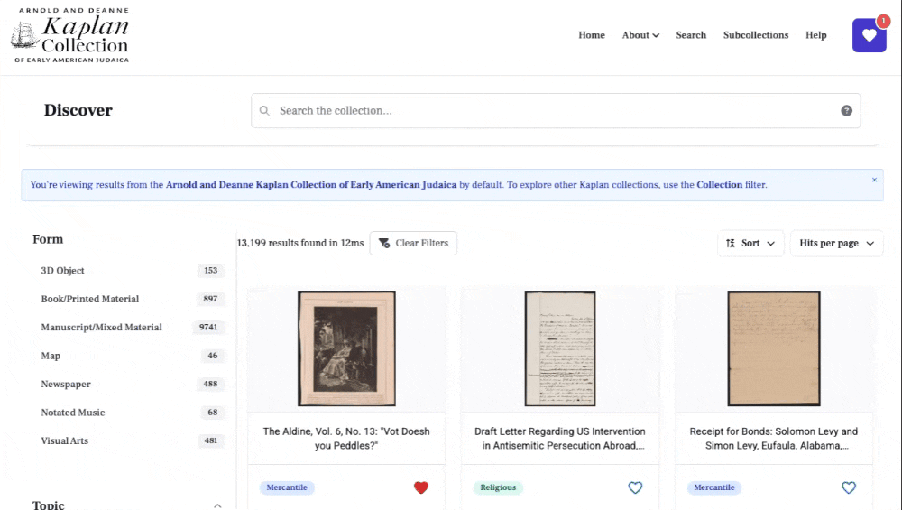

# Help

### Search Page Basics

**1. Use the Search Bar**

* Click the Search bar at the top of the page and type your term(s).
* Results update automatically as you type.

**2. Refine with Filters**

* Use any combination of the filters in the sidebar — the result list updates instantly.
* See “Filters and Facets” below for details.

**3. Sort Results**

* Click the Sort button (top‑right of the results) to reorder by relevance, title, date, or ID.

**4. Change Number of Results Shown on a Page**

* Use the dropdown next to the Sort button to select how many items display on each page (e.g., 20, 40, 80).

**5. Favorite an Item**

* Click the blue-outlined heart icon below any item in the search results to add it to your favorites. Once favorited,
  the heart turns red. Click the red heart again to remove the item from your favorites. The number in the favorites
  icon at the top of the page will update accordingly.

**5. Clear Filters**

* Remove an individual filter by deselecting it in the sidebar or by removing your query text in the search bar.
* To clear all filters click the "Clear Filters" button l.

---

### Filters and Facets

* **Form** : Choose document type(s) (e.g. pamphlets, trade cards, ledgers )
* **Topic**: Select topic(s) to narrow down your search (e.g. Military, Arts & Professions).
* **Language**: Restrict to items in English, Hebrew, German, or any other indexed language.
* **Geography**: Pick one or more places where an item was created or used.
* **Name**: Search for people or organizations associated with the item.
* **Date Range**: Slide or enter "from" — "to" years (e.g., 1800 — 1850) to see only items dated within that span.
* **Collection**: Limits search results to a subset of the Kaplan collection. The Kaplan Collection of Early American
  Judaica is selected by *default*.
* **Subcollections**: Filter by subcollections within the larger Kaplan Collection (e.g. Willy Lindwer Suriname
  Collection)
* **Only Show Items with Images**: Toggle to show only items that have a digitized image available (or vice versa).

In the example shown below, you can see the various filtering and faceting options in action.

_**Tip**: Combining several facets (e.g., Geography + Date + Topic) is the fastest way to zero in on exactly the
materials you need._

---

### Item Page

* **Metadata Panel:** The metadata panel for each item offers information on the title, creator/contributor, date,
  place, physical location, and subject headings associated with the item.

* **IIIF Viewer:** The images that you see to display the item are served by the [IIIF Protocol](https://iiif.io/).
  Images come from [Colenda](https://colenda.library.upenn.edu/). If you want to access the Colenda Record, you can do
  so by opening the information panel on the image viewer.

* **Multiple IIIF Manifests:** You can toggle between multiple manifests associated with an entry by using the bar that
  appears above the image viewer.

* **Favorite an Item:** You can add an item to your favorites by clicking on the heart icon next to the title.

* **Linked‑Data Exports**: There are JSON‑LD, Dublin Core, and RDFa snippets embedded in page source for bibliographic
  integrations.

--- 

### Geography Pages

From an item page, you can click on the geographic metadata. This link will take you to a page where you can browse
items from the collection that have the same geographic metadata.

---

### Subject Pages

On an item page, clicking a subject heading lets you explore other items in the collection with the same subject.
Subject headings are also linked to external data sources, displayed as icons beneath the page title. On the far left,
you’ll find variant forms of the subject name (when available) sourced from the Library of Congress's Linked Data
Service.

---

### Favorites Page

**NOTE:** _The Favorites feature uses your browser’s cache to store selections. If you switch browsers or clear your
cache, your saved favorites will be lost._

There are several ways to favorite or unfavorite items—these are covered in the Item Page and Search Page tutorials
above. To view your full list of favorites, click the heart icon at the top of the page. This will take you to your
Favorites page, where all saved items are displayed.

